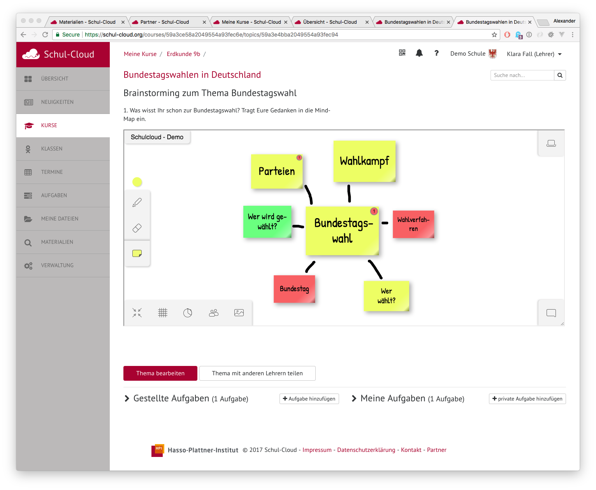

```{r global, include=FALSE}
library(tidyverse)
library(haven)
library(flexdashboard)
library(shiny)
library(shinythemes)
library(extrafont)
library(plotly)
library(readxl)
loadfonts()
```

Forschungsinteresse {data-icon="fa-question-circle"}
========================================================================

Column {data-width=400}
-----------------------------------------------------------------------
### Forschungsinteresse {data-height=200 .boxcenter}
#### Digitalisierung als Chance!
Welchen Mehrwert bieten cloudbasierte Dienste für den Schulalltag und Unterricht aus der Sicht unterschiedlicher Akteure?


### Delphi Studie
Um diese Frage zu untersuchen, führte [Dr. Jürgen Schneider](https://uni-tuebingen.de/de/28915) (Universität Tübingen) im Auftrag des [Hasso-Plattner-Instituts](https://hpi.de/) (BMBF-geördertes Projekt) eine Delphi-Studie durch.

Delphi-Studien dienen dazu, Lösungsmöglichkeiten für komplexe Fragestellungen (z.B. Zukunftsszenarien) zu liefern. Die Lösungsmöglichkeiten (hier: Mehrwerte der Schul-Cloud Dienste) entstehen als Produkt einer zweiphasigen Gruppenkommunikation zwischen Akteuren, deren Arbeitsbereiche sich auf unterschiedliche Weise mit der Schul-Cloud überschneiden.

1. Phase: Sammlung von Mehrwerten der cloudbasierten Dienste durch Akteure
2. Phase: Systematisierung der genannten Mehrwerte durch Forschende, Einschätzung der Bedeutsamkeit der genannten Mehrwerte durch Akteure

Befragt wurden

* Lehrpersonen, die bereits kontakt mit der Schul-Cloud hatten („Praktiker*innen“), 
* Dozierende der Staatlichen Seminare im Fachbereich Mediendidaktik („Multiplikator*innen“)
* Entwickler*innen der Schul-Cloud
* wissenschaftlich Forschende zum Thema digitale Medien


Column {data-width=600 .tabset}
-----------------------------------------------------------------------
#### Beschreibungen


_der acht digitalen Dienste der [Schul-Cloud](https://schul-cloud.org) (zum Zeitpunkt der Studie)_
\
\
  

### Inhalte Dienst
```{r}
fluidPage(
  fluidRow(
    column(12,
      p("Über den Dienst „Inhalte“ können sowohl Lehrpersonen als auch Schüler*innen auf Lerninhalte zugreifen. Die Formate sind vielzählig und reichen von Text- und Videoerklärungen, über Lernprogramme, bis hin zu multimedial-didaktisch aufbereiteten Lerneinheiten mit Arbeitsblättern und Testaufgaben. Eingebettet sind die Inhalte mehrerer Anbieter, die gesammelt an einer Stelle angeboten und über ein Suchinterface zugänglich gemacht werden. Optional sind die Inhalte für bestimmte Altersstufen gekennzeichnet und mit Bewertungen versehen."),
      HTML(" ")
    )
  )
)
```


### Teilen und Bearbeiten
Das Ziel des Dienstes „Teilen und Bearbeiten von Materialien“ ist es, die Lehrkräfte-Community zu vernetzen, um so Synergien zu ermöglichen. Hierzu werden Materialien und Inhalte anderer Lehrpersonen und Drittanbieter zugänglich gemacht. Ein Editor ermöglicht es den Lehrpersonen die Materialien zu bearbeiten oder anzupassen, um sie in Ihren Klassen nutzbar zu machen. Hierbei sind geeignete Lizenzen der Materialien innerhalb der Schul-Cloud bedeutend.  
  
Der Dienst „Teilen und Bearbeiten von Materialien“ ist in der bisherigen Version der Schul-Cloud (Stand 4/2018) noch nicht umgesetzt. Im Folgenden werden deshalb Potenziale des Dienstes dargestellt, wie sie durch die Akteure antizipiert wurden. 


### Benachrichtigungsdienst
```{r}
fluidPage(
  fluidRow(
    column(12,
      p("Anhand des Benachrichtigungsdienstes werden Nachrichten durch Lehrpersonen oder von dafür freigeschalteten Lernprogrammen versendet. Als Empfänger können selbst definierte Gruppen oder ganze Klassen (bzw. Lerngruppen) adressiert werden. Die Benachrichtigungen bestehen aus einem Titel und einem kurzen Benachrichtigungstext. Sie können Links auf Webseiten oder Dokumente enthalten sowie mit einer App oder einer Aktion (z.B. Öffnen des Stundenplans) verknüpft sein. Der Benachrichtigungsdienst erlaubt es einzustellen, ob ein Empfangsgerät zur Anzeige der Nachricht aufgeweckt oder die Nachricht erst bei der nächsten Aktivierung des Geräts angezeigt werden soll."),
      HTML(" ")
    )
  )
)
```


### Kalender

```{r}
fluidPage(
  fluidRow(
    column(12,
      p("Die Schul-Cloud stellt einen Kalender-Dienst zur Verfügung, der alle Termine oder Events organisiert. Dieser erlaubt die Unterscheidung zwischen Einträgen, die entweder nur einzelnen Nutzer*innen zugeordnet werden oder für größere Gruppen (Klasse, Arbeitsgemeinschaft, Jahrgang, Schule) sichtbar bzw. bearbeitbar sind."),
      p("Bei Bedarf werden Nutzer *innen durch eine Benachrichtigungsfunktion zu einem festgelegten Zeitpunkt an den Eintrag erinnert."),
      HTML(" ")
    )
  )
)
```
  


### Dateimanagement
```{r}
fluidPage(
  fluidRow(
    column(12,
      p("Der Dateimanagement-Dienst bietet die cloudbasierte Ablage von Dateien für Schüler*innen und Lehrpersonen mit einfacher drag-and-drop-Funktion. Der Zugriff auf die Dateien ist somit unabhängig vom verwendeten Endgerät, potentiell synchronisierbar und offline zugreifbar. Freigabeeinstellungen erlauben eine Unterscheidung zwischen Dateien,"),
      HTML("<ul><li>auf die nur Nutzer*innen selbst Zugriff haben (persönliche Ordner),</li><li>auf die bestimmte Kurse Zugriff haben (Kurs-Dateien),</li><li>die mit anderen Nutzer*innen geteilt werden (mit mir geteilte Dateien).</li></ul>"),
      HTML(" ")
    )
  )
)
```


### Hausaugaben
```{r}
fluidPage(
  fluidRow(
    column(12,
      p("Anhand des (Haus-)aufgaben-Dienstes können digitale Arbeitsaufträge und Aufgaben gestellt und abgegeben werden. Sowohl Schüler*innen als auch Lehrpersonen haben grundsätzlich die Möglichkeit Aufgaben anzulegen. Für die Aufgabenstellung selbst ist die Möglichkeit gegeben einen Aufgabentext zu formulieren, der mit Bildern, Videos oder downloadbaren Dateien sowie Abgabedaten versehen ist."),
      p("Die Schüler*innen können ihre Lösung per integriertem Editor oder anhand eines Dateiuploads (z.B. Foto einer Mobilkamera) einreichen. Lehrpersonen sehen in der Aufgabenübersicht, wie viele Schüler*innen bereits abgegeben haben (Prozentabgabe sowie tabellarische Übersicht) und können dies in der Detailansicht für jede/n Schüler*in nachvollziehen."),
      p("Des Weiteren besteht für Lehrkräfte mittels des integrierten Editors die Möglichkeit, direktes Feedback zu den Abgaben der Schüler*innen zu formulieren. In der Übersicht der Schul-Cloud werden den Schüler*innen in einer To-do-Liste die anstehenden Aufgaben inklusive Abgabedatum angezeigt."),
      HTML(" ")
    )
  )
)
```
  
  
  
### Kollaboration
```{r}
fluidPage(
  fluidRow(
    column(12,
      p("Unter den Kollaborations-Dienst fallen webbasierte Tools, die explizit gemeinsames Arbeiten der Nutzer*innen ermöglichen und fördern. Hierzu zählen Editoren, in denen Präsentationen oder Texte unter gleichzeitigem Zugriff mehrerer Nutzer*innen erstellt und bearbeitet werden. Denkbar sind hierbei die Integration von Office 365 oder Open Source Alternativen."),
      p("Aktuell sind in der Schul-Cloud die Dienste „Etherpad“ zur kollaborativen Erstellung von Texten und „neXboard“ zum gemeinsamen Brainstorming integriert."),
      HTML(" ")
    )
  )
)
```
  


### Learning Analytics
Der Bereich Learning-Analytics stellt Tools zur Verfügung, anhand derer Lerndaten gemessen, gesammelt, analysiert und ausgewertet werden. Hierzu zählen Tools, um digitale Tests oder Quizzes u erstellen. Weiterhin werden Lerndaten aus verwendeten Lernprogrammen zusammengetragen und bereitgestellt.  
  
Oberstes Gebot ist dabei die Daten- und Rechtssicherheit. Drittanbieter erhalten nie die Klarnamen der Lernenden, sondern Pseudonyme, anhand derer keine Rückschlüsse auf die Identität der Person gezogen werden können. Zudem wird sichergestellt, dass die innerhalb der Schul-Cloud erhobenen Daten (z.B. Quiz) nicht nach außen gelangen.  
  
Die Tools für Learning Analytics sind in der bisherigen Version der Schul-Cloud (Stand 4/2018) noch nicht umgesetzt. Im Folgenden werden deshalb Potenziale des Dienstes dargestellt, wie sie durch die Expertengruppen antizipiert wurden.  
  


Delphi Phase 1 {data-icon="fa-comments"}
=======================================================================

Column {.tabset}
-----------------------------------------------------------------------

### Methodik

```{r}
phase1 <- read_sav("data/delphi_phase1.sav")

phase1 <- phase1%>%
            group_by(perspektive)%>%
            mutate(bar_length = length(perspektive))%>%
            ungroup()
  
phase1$perspektive <- plyr::mapvalues(phase1$perspektive,
                                      c("entwi", "lehrp", "semin", "wiss"),
                                      c("Entwickler/innen",
                                        "Lehrpersonen",
                                        "Dozierende staatl. Seminar",
                                        "Wissenschaftler/innen"))
  
# colour blind palette
cbPalette <- c("#999999", "#E69F00", "#56B4E9", "#009E73", "#CC79A7", "#F0E442", "#0072B2", "#D55E00")

#order of bars
phase1$perspektive <- factor(phase1$perspektive,
                             levels = c("Wissenschaftler/innen",
                                        "Dozierende staatl. Seminar",
                                        "Lehrpersonen",
                                        "Entwickler/innen"))

# plot 1
p1 <- ggplot(phase1, aes(x=perspektive, fill = perspektive))
plot_sample1 <- p1 + 
  geom_bar() +
  labs(x = "", y = "") +
  scale_x_discrete(expand = c(0, 0)#,
                   # labels = c("Entwickler/\ninnen",
                   #            "Lehrpersonen",
                   #            "Dozierende \nstaatl. Seminar",
                   #            "Wissenschaftler/\ninnen")
                   ) +
  scale_y_discrete(expand = c(0, 0)) +
  theme(legend.position = "none",
        text = element_text(size=24,  family="Open Sans", colour = "#32414B"),
        axis.text.y = element_text(colour="#32414B"),
        panel.background = element_rect(fill = "transparent", colour = NA),
        plot.background = element_rect(fill = "transparent", colour = NA),
        axis.line.y = element_line()
        ) +
  geom_text(aes(label = bar_length, y = bar_length-1), colour = "#F2F2F2", size = 8) +
  scale_fill_manual(values=cbPalette) +
  coord_flip()


fluidPage(
  fluidRow(
    column(width = 5,
           fluidRow(
             column(width = 12,
                    wellPanel(
                      strong("Ziel"),
                      p("Einsatzbereiche der acht digitalen Dienste der Schul-Cloud zu sammeln, um somit einen Pool an Einsatzbereichen zu gewinnen. Der Prozess ist bewusst auf Breite angelegt (unterschiedlichste Einsatzbereiche) und soll entsprechend durch die Forschenden nicht vorgeprägt sein.")
                      )
                )
              ),
           fluidRow(
             column(width = 12,
                    wellPanel(
                      strong("Design"),
                      HTML("<ul><li>den Teilnehmenden werden zufällig 4 der 8 Dienste zugewiesen</li><li>die Reihenfolge der 4 Dienste wird zufällig variiert (Verhinderung von Reihenfolgeneffekten)</li><li>bzgl. jeden Dienstes werden dessen mögliche Einsatzbereiche im Unterricht und Schulalltag, sowie dessen Voraussetzungen (Gelingensbedingungen) in einem offenen Item abgefragt.</li><li>Druck und Onlineversion des Fragebogens siehe <a href='https://osf.io/6h59y/' target='_blank'>hier</a>.</li></ul>")
                    )
                    )
           )
                 
                 ),
    column(width = 7,
           # wellPanel(
             strong("Stichprobe"),
             renderPlot(plot_sample1, width = 600, height = 400)
           # )
      )
    
  )
)


```


### Ergebnisse

```{r}

phase1_erg <- phase1 %>%
  select(-c(DienstWeitere, weitereBer, weitereBerBed, weitereArrang, weitereArrangBed)) %>%
  gather(key="variable", value="value", 8:39) %>%
  mutate(dienst = case_when(
                    str_detect(variable,"benach") ~ "Benachrichtigungsdienst",
                    str_detect(variable,"datei") ~ "Dateimanagement",
                    str_detect(variable,"erst") ~ "Teilen und Bearbeiten",
                    str_detect(variable,"haus") ~ "(Haus-) Aufgaben",
                    str_detect(variable,"inh") ~ "Inhaltsdienst",
                    str_detect(variable,"kal") ~ "Kalender",
                    str_detect(variable,"learn") ~ "Learning Analytics",
                    str_detect(variable,"koll") ~ "Kollaboration"
  )) %>%
  filter(((rel1 == 1 | rel2 == 1 | rel3 == 1 | rel4 == 1) & dienst == "Inhaltsdienst") |            # filter only services that were allocated
         ((rel1 == 2 | rel2 == 2 | rel3 == 2 | rel4 == 2) & dienst == "Teilen und Bearbeiten") |
         ((rel1 == 3 | rel2 == 3 | rel3 == 3 | rel4 == 3) & dienst == "Benachrichtigungsdienst") |
         ((rel1 == 4 | rel2 == 4 | rel3 == 4 | rel4 == 4) & dienst == "Kalender") |
         ((rel1 == 5 | rel2 == 5 | rel3 == 5 | rel4 == 5) & dienst == "Dateimanagement") |
         ((rel1 == 6 | rel2 == 6 | rel3 == 6 | rel4 == 6) & dienst == "(Haus-) Aufgaben") |
         ((rel1 == 7 | rel2 == 7 | rel3 == 7 | rel4 == 7) & dienst == "Kollaboration") |
         ((rel1 == 8 | rel2 == 8 | rel3 == 8 | rel4 == 8) & dienst == "Learning Analytics")) %>%
  filter(value != "- ...\n\n- ..." & value != "" & value != "-" & value != "?" & value != "s. Vorseite" & value != "Fördert erfolgreichen Einsatz:\n- ...\n\nVerhindert erfolgreichen Einsatz:\n- ...") %>%
  mutate(bereich = ifelse(str_detect(variable, "ArrangBed"), "unt_bed",
                          ifelse(str_detect(variable, "BerBed"), "sch_bed",
                                 ifelse(str_detect(variable, "Arrang"), "unt_ein", "sch_ein"))))


# reactive text output
out_ein <- reactive({
                  tmp <- phase1_erg %>%
                           filter(dienst == input$dienst1 & bereich == paste(input$bereich1, "_ein", sep = "") & perspektive  %in% input$personen)
                  tmp$value
                  
})
out_bed <- reactive({
                  tmp <- phase1_erg %>%
                           filter(dienst == input$dienst1 & bereich == paste(input$bereich1, "_bed", sep = "") & perspektive  %in% input$personen)
                  tmp$value
                  
})

```

```{r}
fluidPage(
  fluidRow(
    column(width = 2,
                    wellPanel(
                      style = "overflow-x:scroll;",
                      selectInput("dienst1", strong("Dienst"), unique(phase1_erg$dienst), selected = "Inhaltsdienst"),
                      radioButtons("bereich1", "Fokus", c("Unterricht" = "unt", "Schulalltag" = "sch")),
                      checkboxGroupInput("personen", strong("Akteure anzeigen"), choices = unique(phase1_erg$perspektive),
                                         selected = unique(phase1_erg$perspektive))
                      )
           ),
    column(width = 5,
           wellPanel(
             style = "overflow-y:scroll; max-height: 80vh",
             strong("Einsatzbereiche"),
             renderUI(HTML(paste(out_ein(), collapse = "<br /><br /><hr />")))
             
           )
           ),
    column(width = 5,
           wellPanel(
             style = "overflow-y:scroll; max-height: 80vh",
             strong("Voraussetzungen"),
             renderUI(HTML(paste(out_bed(), collapse = "<br /><br /><hr />")))
           )
           )
  )
)

```


Delphi Phase 2 {data-icon="fa-tachometer-alt"}
=======================================================================

Column {.tabset}
-----------------------------------------------------------------------

### Methodik


```{r}
# dropdown: dienste + alle im vergleich
# checkbox: Akteure anzeigen (unterschiedliche Farben)

# boxplot + scatter (nur horizontal)
# 
```

```{r}
phase2 <- read_sav("data/delphi_phase2.sav")

phase2 <- phase2%>%
            group_by(perspektive)%>%
            mutate(bar_length = length(perspektive))%>%
            ungroup()
  
phase2$perspektive <- plyr::mapvalues(phase2$perspektive,
                                      c("entwi", "lehrp", "semin", "wiss"),
                                      c("Entwickler/innen",
                                        "Lehrpersonen",
                                        "Dozierende staatl. Seminar",
                                        "Wissenschaftler/innen"))
  
#order of bars
phase2$perspektive <- factor(phase2$perspektive,
                             levels = c("Wissenschaftler/innen",
                                        "Dozierende staatl. Seminar",
                                        "Lehrpersonen",
                                        "Entwickler/innen"))

# plot 2
p2 <- ggplot(phase2, aes(x=perspektive, fill = perspektive))
plot_sample2 <- p2 + 
  geom_bar() +
  labs(x = "", y = "") +
  scale_x_discrete(expand = c(0, 0)#,
                   # labels = c("Entwickler/\ninnen",
                   #            "Lehrpersonen",
                   #            "Dozierende \nstaatl. Seminar",
                   #            "Wissenschaftler/\ninnen")
                   ) +
  scale_y_discrete(expand = c(0, 0)) +
  theme(legend.position = "none",
        text = element_text(size=24,  family="Open Sans", colour = "#32414B"),
        axis.text.y = element_text(colour="#32414B"),
        panel.background = element_rect(fill = "transparent", colour = NA),
        plot.background = element_rect(fill = "transparent", colour = NA),
        axis.line.y = element_line()
        ) +
  geom_text(aes(label = bar_length, y = bar_length-1.5), colour = "#F2F2F2", size = 8) +
  scale_fill_manual(values=cbPalette) +
  coord_flip()


fluidPage(
  fluidRow(
    column(width = 5,
           fluidRow(
             column(width = 12,
                    wellPanel(
                      strong("Ziel"),
                      p("Einstufung des Mehrwerts der in der ersten Runde genannten Einsatzbereiche")
                      )
                )
              ),
           fluidRow(
             column(width = 12,
                    wellPanel(
                      strong("Design"),
                      HTML("<ul><li>den Teilnehmenden werden zufällig 4 der 8 Dienste zugewiesen</li><li>die Reihenfolge der 4 Dienste wird zufällig variiert (Verhinderung von Reihenfolgeneffekten)</li><li>bzgl. jeden Dienstes werden dessen (aus der ersten Phase genannten) Einsatzbereiche im Unterricht und Schulalltag und Voraussetzungen (Gelingensbedingungen) beschrieben.</li><li>für jeden Einsatzbereich wurde auf einer 6-stufigen Likert-Skala (\"gar nicht\" bis \"sehr\") eingestuft, inwiefern er \"einen Gewinn für den Unterricht darstellen kann\"</li><li>für jeden Einsatzbereich wurde auf einer 6-stufigen Likert-Skala (\"gar nicht\" bis \"sehr\") eingestuft, wie bedeutsam die Voraussetzungen für den erfolgreichen Einsatz des Dienstes sind</li><li>Druck und Onlineversion des Fragebogens siehe <a href='https://osf.io/6h59y/' target='_blank'>hier</a>.</li></ul>")
                    )
                    )
           )
                 
                 ),
    column(width = 7,
           # wellPanel(
             strong("Stichprobe"),
             renderPlot(plot_sample2, width = 600, height = 400)
           # )
      )
    
  )
)


```


### Ergebnisse

```{r, cache=F}

varitem <- read_xlsx(path = "data/var-item.xlsx")


phase2_erg1 <- phase2 %>%
  select(-bar_length) %>%
  gather(key = "variable", value = "value", 8:146) %>%
  mutate(dienst = case_when(
                    str_detect(variable,"benach") ~ "Benachrichtigungsdienst",
                    str_detect(variable,"datei") ~ "Dateimanagement",
                    str_detect(variable,"erst") ~ "Teilen und Bearbeiten",
                    str_detect(variable,"haus") ~ "(Haus-) Aufgaben",
                    str_detect(variable,"inh") ~ "Inhaltsdienst",
                    str_detect(variable,"kal") ~ "Kalender",
                    str_detect(variable,"learn") ~ "Learning Analytics",
                    str_detect(variable,"koll") ~ "Kollaboration"
  )) %>%
  filter(((rel1 == 1 | rel2 == 1 | rel3 == 1 | rel4 == 1) & dienst == "Inhaltsdienst") |            # filter only services that were allocated
         ((rel1 == 2 | rel2 == 2 | rel3 == 2 | rel4 == 2) & dienst == "Teilen und Bearbeiten") |
         ((rel1 == 3 | rel2 == 3 | rel3 == 3 | rel4 == 3) & dienst == "Benachrichtigungsdienst") |
         ((rel1 == 4 | rel2 == 4 | rel3 == 4 | rel4 == 4) & dienst == "Kalender") |
         ((rel1 == 5 | rel2 == 5 | rel3 == 5 | rel4 == 5) & dienst == "Dateimanagement") |
         ((rel1 == 6 | rel2 == 6 | rel3 == 6 | rel4 == 6) & dienst == "(Haus-) Aufgaben") |
         ((rel1 == 7 | rel2 == 7 | rel3 == 7 | rel4 == 7) & dienst == "Kollaboration") |
         ((rel1 == 8 | rel2 == 8 | rel3 == 8 | rel4 == 8) & dienst == "Learning Analytics")) %>%
  mutate(bereich = ifelse(str_detect(variable, "ArrangBed"), "unt_bed",
                          ifelse(str_detect(variable, "BerBed"), "sch_bed",
                                 ifelse(str_detect(variable, "Arrang"), "unt_ein", "sch_ein")))) %>%
  left_join(., varitem, by = "variable")


phase2_erg2 <- phase2 %>%
  select(-c(bar_length, id, rel1, rel2, rel3, rel4, version)) %>%
  group_by(perspektive) %>%
  summarize_all(.funs = (mean), na.rm = TRUE) %>%
  ungroup() %>%
  gather(key = "variable", value = "value", 2:140) %>%
  mutate(dienst = case_when(
                    str_detect(variable,"benach") ~ "Benachrichtigungsdienst",
                    str_detect(variable,"datei") ~ "Dateimanagement",
                    str_detect(variable,"erst") ~ "Teilen und Bearbeiten",
                    str_detect(variable,"haus") ~ "(Haus-) Aufgaben",
                    str_detect(variable,"inh") ~ "Inhaltsdienst",
                    str_detect(variable,"kal") ~ "Kalender",
                    str_detect(variable,"learn") ~ "Learning Analytics",
                    str_detect(variable,"koll") ~ "Kollaboration"
  )) %>%
  mutate(bereich = ifelse(str_detect(variable, "ArrangBed"), "unt_bed",
                          ifelse(str_detect(variable, "BerBed"), "sch_bed",
                                 ifelse(str_detect(variable, "Arrang"), "unt_ein", "sch_ein")))) %>%
  left_join(., varitem, by = "variable")


phase2_erg3 <- phase2 %>%
  select(-c(bar_length, id, rel1, rel2, rel3, rel4, version)) %>%
  group_by(perspektive) %>%
  summarize_all(.funs = (mean), na.rm = TRUE) %>%
  ungroup() %>%
  gather(key = "variable", value = "value", 2:140) %>%
  mutate(dienst = case_when(
                    str_detect(variable,"benach") ~ "Benachrichtigungsdienst",
                    str_detect(variable,"datei") ~ "Dateimanagement",
                    str_detect(variable,"erst") ~ "Teilen und Bearbeiten",
                    str_detect(variable,"haus") ~ "(Haus-) Aufgaben",
                    str_detect(variable,"inh") ~ "Inhaltsdienst",
                    str_detect(variable,"kal") ~ "Kalender",
                    str_detect(variable,"learn") ~ "Learning Analytics",
                    str_detect(variable,"koll") ~ "Kollaboration"
  ))%>%
  mutate(bereich = ifelse(str_detect(variable, "ArrangBed"), "unt_bed",
                          ifelse(str_detect(variable, "BerBed"), "sch_bed",
                                 ifelse(str_detect(variable, "Arrang"), "unt_ein", "sch_ein")))) %>%
  group_by(dienst, perspektive, bereich) %>%
  summarize(value = mean(value, na.rm=T)) %>%
  ungroup() 


fluidPage(
  fluidRow(
    column(width = 3,
                    wellPanel(
                      radioButtons("vergl", strong("Vergleich"), c("zwischen Diensten" = "zwi", "innerhalb eines Dienstes" = "inn")),
                      conditionalPanel("input.vergl == 'inn'",
                                       selectInput("dienst2", strong("Dienst"), choices = unique(phase2_erg1$dienst), selected = "Inhaltsdienst")
                                       ),
                      conditionalPanel("input.vergl == 'zwi'",
                                       selectInput("bereich2", strong("Bereich"), 
                                                   choices = c("Einsatzbereiche im Unterricht" = "unt_ein",
                                                               "Voraussetzungen im Unterricht" = "unt_bed",
                                                               "Einsatzbereiche im Schulalltag" = "sch_ein",
                                                               "Voraussetzungen im Schulalltag" = "sch_bed"),
                                                   selected = "unt_ein")
                      ),
                      conditionalPanel("input.vergl == 'inn'",
                                       selectInput("bereich3", strong("Bereich"), 
                                                   choices = c("Unterricht, Schulalltag & Voraussetzungen" = "all",
                                                               "Einsatzbereiche im Unterricht" = "unt_ein",
                                                               "Voraussetzungen im Unterricht" = "unt_bed",
                                                               "Einsatzbereiche im Schulalltag" = "sch_ein",
                                                               "Voraussetzungen im Schulalltag" = "sch_bed"),
                                                   selected = "all")
                      ),
                      # conditionalPanel("(input.bereich2 == 'unt_ein' | input.bereich2 == 'sch_ein') & input.vergl == 'zwi' ",
                      #   radioButtons("teiln1", strong("Punkte in Grafik sind..."),
                      #                c("Mittlerer Mehrwert über alle Einsatzbereiche" = "mwm", 
                      #                  "Mittelwerte der Akteursgruppen für jeden Einsatzbereich" = "mwa",
                      #                  "Einzelwerte der Akteure" = "akt"),
                      #                selected = "mwm")
                      #   ),
                      # conditionalPanel("(input.bereich2 == 'unt_bed' | input.bereich2 == 'sch_bed') & input.vergl == 'zwi' ",
                      #   radioButtons("teiln2", strong("Punkte in Grafik sind..."),
                      #                c("Mittlere Bedeutsamkeit über alle Voraussetzungen" = "mwm", 
                      #                  "Mittelwerte der Akteursgruppen für jede Voraussetzung" = "mwa",
                      #                  "Einzelwerte der Akteure" = "akt"),
                      #                selected = "mwm")
                      #   ),
                      conditionalPanel("(input.bereich3 != 'unt_ein' & input.bereich3 != 'unt_bed' & input.bereich3 != 'sch_ein' & input.bereich3 != 'sch_bed') | input.vergl == 'zwi'",
                                       strong("Einsatzbereiche/ Voraussetzungen"),
                                       checkboxInput("einzeln", 
                                                     HTML(paste("einzeln anzeigen", br(), "(zur Anzeige Maus über Punkte bewegen)")))
                      )
                      )
           ),
    column(width = 9,
           renderPlotly({
             if (input$vergl == "zwi" & (input$bereich2 == "unt_ein" | input$bereich2 == "sch_ein") & input$einzeln == FALSE) {
                tmp1.1a <- phase2_erg3 %>%
                  filter(bereich == input$bereich2)

                plot_out2 <- ggplot(tmp1.1a, aes(x = dienst, y = value)) +
                  geom_jitter(aes(color = perspektive), width = 0.1, height = 0, size = 3) +
                  scale_x_discrete(expand = c(0, 0.2)) +
                  scale_y_continuous(expand = c(0, 0), limits = c(1,6), breaks = c(1,2,3,4,5,6)) +
                  stat_summary(fun.y = "mean", colour = "#293133", size = 11, geom = "point", shape = 95) +
                  ylab("Mehrwert der Einsatzbereiche") +
                  xlab("") +
                  theme(text = element_text(size=18,  family="Open Sans", colour = "#32414B"),
                        axis.text.y = element_text(colour="#32414B"),
                        axis.text.x = element_text(angle = -45, hjust = 0),
                        # panel.background = element_rect(fill = "#f7fbf5", colour = NA),
                        plot.background = element_rect(fill = "transparent", colour = NA),
                        panel.grid = element_blank(),
                        legend.title = element_blank()
                        )
                
                plot_out2 <- ggplotly(plot_out2, height = 700, tooltip = c("perspektive", "value"))
             }

             if (input$vergl == "zwi" & (input$bereich2 == "unt_bed" | input$bereich2 == "sch_bed") & input$einzeln == FALSE) {
                tmp1.1b <- phase2_erg3 %>%
                  filter(bereich == input$bereich2)

                plot_out2 <- ggplot(tmp1.1b, aes(x = dienst, y = value)) +
                  geom_jitter(aes(color = perspektive), width = 0.1, height = 0, size = 3) +
                  scale_x_discrete(expand = c(0, 0.2)) +
                  scale_y_continuous(expand = c(0, 0), limits = c(1,6), breaks = c(1,2,3,4,5,6)) +
                  stat_summary(fun.y = "mean", colour = "#293133", size = 11, geom = "point", shape = 95) +
                  ylab("Bedeutsamkeit der Voraussetzungen") +
                  xlab("") +
                  theme(text = element_text(size=18,  family="Open Sans", colour = "#32414B"),
                        axis.text.y = element_text(colour="#32414B"),
                        axis.text.x = element_text(angle = -45, hjust = 0),
                        # panel.background = element_rect(fill = "#f7fbf5", colour = NA),
                        plot.background = element_rect(fill = "transparent", colour = NA),
                        panel.grid = element_blank(),
                        legend.title = element_blank()
                        )
                
                plot_out2 <- ggplotly(plot_out2, height = 700, tooltip = c("perspektive", "value"))
              }
             
             
             if (input$vergl == "zwi" & (input$bereich2 == "unt_ein" | input$bereich2 == "sch_ein") & input$einzeln == TRUE) {
                tmp1.2a <- phase2_erg2 %>%
                  filter(bereich == input$bereich2)

                plot_out2 <- ggplot(tmp1.2a, aes(x = dienst, y = value)) +
                  geom_jitter(aes(color = perspektive, name = einsatzbereich), width = 0.1, height = 0, size = 3) +
                  scale_x_discrete(expand = c(0, 0.2)) +
                  scale_y_continuous(expand = c(0, 0), limits = c(1,6), breaks = c(1,2,3,4,5,6)) +
                  stat_summary(fun.y = "mean", colour = "#293133", size = 11, geom = "point", shape = 95) +
                  ylab("Mehrwert der Einsatzbereiche") +
                  xlab("") +
                  theme(text = element_text(size=18,  family="Open Sans", colour = "#32414B"),
                        axis.text.y = element_text(),
                        axis.text.x = element_text(angle = -45, hjust = 0),
                        # panel.background = element_rect(fill = "#f7fbf5", colour = NA),
                        plot.background = element_rect(fill = "transparent", colour = NA),
                        panel.grid = element_blank(),
                        legend.title = element_blank()
                        )
                
                plot_out2 <- ggplotly(plot_out2, height = 700, tooltip = c("perspektive", "value", "einsatzbereich"))
             }

             
             if (input$vergl == "zwi" & (input$bereich2 == "unt_bed" | input$bereich2 == "sch_bed") & input$einzeln == TRUE) {
                tmp1.2b <- phase2_erg2 %>%
                  filter(bereich == input$bereich2)

                plot_out2 <- ggplot(tmp1.2b, aes(x = dienst, y = value)) +
                  geom_jitter(aes(color = perspektive, name = einsatzbereich), width = 0.1, height = 0, size = 3) +
                  scale_x_discrete(expand = c(0, 0.2)) +
                  scale_y_continuous(expand = c(0, 0), limits = c(1,6), breaks = c(1,2,3,4,5,6)) +
                  stat_summary(fun.y = "mean", colour = "#293133", size = 11, geom = "point", shape = 95) +
                  ylab("Bedeutsamkeit der Voraussetzungen") +
                  xlab("") +
                  theme(text = element_text(size=18,  family="Open Sans", colour = "#32414B"),
                        axis.text.y = element_text(),
                        axis.text.x = element_text(angle = -45, hjust = 0),
                        # panel.background = element_rect(fill = "#f7fbf5", colour = NA),
                        plot.background = element_rect(fill = "transparent", colour = NA),
                        panel.grid = element_blank(),
                        legend.title = element_blank()
                        )
                
                plot_out2 <- ggplotly(plot_out2, height = 700, tooltip = c("perspektive", "value", "einsatzbereich"))
             }
             
             
             # if (input$vergl == "zwi" & (input$bereich2 == "unt_ein" | input$bereich2 == "sch_ein") & input$teiln1 == "akt") {
             #    tmp1.3a <- phase2_erg1 %>%
             #      filter(bereich == input$bereich2)
             # 
             #    plot_out2 <- ggplot(tmp1.3a, aes(x = dienst, y = value)) +
             #      geom_jitter(aes(color = perspektive, name = einsatzbereich), width = 0.1, height = 0.1, size = 1) +
             #      scale_x_discrete(expand = c(0, 0.2)) +
             #      scale_y_continuous(expand = c(0, 0), limits = c(1,6), breaks = c(1,2,3,4,5,6)) +
             #      stat_summary(fun.y = "mean", colour = "#293133", size = 11, geom = "point", shape = 95) +
             #      ylab("Mehrwert der Einsatzbereiche") +
             #      xlab("") +
             #      labs(title = "Um die Einsatzbereiche zu sehen, bewegen Sie Ihre Maus über die Punkte.") +
             #      theme(text = element_text(size=18,  family="Open Sans", colour = "#32414B"),
             #            axis.text.y = element_text(),
             #            axis.text.x = element_text(angle = -45, hjust = 0),
             #            # panel.background = element_rect(fill = "#f7fbf5", colour = NA),
             #            plot.background = element_rect(fill = "transparent", colour = NA),
             #            panel.grid = element_blank(),
             #            legend.title = element_blank()
             #            )
             #    
             #    plot_out2 <- ggplotly(plot_out2, height = 700, tooltip = c("perspektive", "value", "einsatzbereich"))
             # }
             # 
             # 
             # if (input$vergl == "zwi" & (input$bereich2 == "unt_bed" | input$bereich2 == "sch_bed") & input$teiln2 == "akt") {
             #    tmp1.3b <- phase2_erg1 %>%
             #      filter(bereich == input$bereich2)
             # 
             #    plot_out2 <- ggplot(tmp1.3b, aes(x = dienst, y = value)) +
             #      geom_jitter(aes(color = perspektive, name = einsatzbereich), width = 0.1, height = 0.1, size = 1) +
             #      scale_x_discrete(expand = c(0, 0.2)) +
             #      scale_y_continuous(expand = c(0, 0), limits = c(1,6), breaks = c(1,2,3,4,5,6)) +
             #      stat_summary(fun.y = "mean", colour = "#293133", size = 11, geom = "point", shape = 95) +
             #      ylab("Bedeutsamkeit der Voraussetzungen") +
             #      xlab("") +
             #      labs(title = "Um die Einsatzbereiche zu sehen, bewegen Sie Ihre Maus über die Punkte.") +
             #      theme(text = element_text(size=18,  family="Open Sans", colour = "#32414B"),
             #            axis.text.y = element_text(),
             #            axis.text.x = element_text(angle = -45, hjust = 0),
             #            # panel.background = element_rect(fill = "#f7fbf5", colour = NA),
             #            plot.background = element_rect(fill = "transparent", colour = NA),
             #            panel.grid = element_blank(),
             #            legend.title = element_blank()
             #            )
             #    
             #    plot_out2 <- ggplotly(plot_out2, height = 700, tooltip = c("perspektive", "value", "einsatzbereich"))
             # }
             
             
             if (input$vergl == "inn" & input$bereich3 == "all" & input$einzeln == FALSE) {
                tmp1.4a <- phase2_erg3 %>%
                  filter(dienst == input$dienst2)

                plot_out2 <- ggplot(tmp1.4a, aes(x = factor(bereich, levels = c("unt_ein", "unt_bed", "sch_ein", "sch_bed"), labels = c("Einsatzbereiche<br />im Unterricht", "Voraussetzungen<br />im Unterricht", "Einsatzbereiche<br />im Schulalltag", "Voraussetzungen<br />im Schulalltag")), y = value)) +
                  geom_jitter(aes(color = perspektive), width = 0.1, height = 0, size = 3) +
                  scale_x_discrete(expand = c(0, 0.2)) +
                  scale_y_continuous(expand = c(0, 0), limits = c(1,6), breaks = c(1,2,3,4,5,6)) +
                  stat_summary(fun.y = "mean", colour = "#293133", size = 11, geom = "point", shape = 95) +
                  ylab("Mehrwert / Bedeutsamkeit") +
                  xlab("") +
                  theme(text = element_text(size=18,  family="Open Sans", colour = "#32414B"),
                        axis.text.y = element_text(colour="#32414B"),
                        axis.text.x = element_text(angle = -45, hjust = 0),
                        # panel.background = element_rect(fill = "#f7fbf5", colour = NA),
                        plot.background = element_rect(fill = "transparent", colour = NA),
                        panel.grid = element_blank(),
                        legend.title = element_blank()
                        )
                
                plot_out2 <- ggplotly(plot_out2, height = 700, tooltip = c("perspektive", "value"))
             }
             
             
             if (input$vergl == "inn" & input$bereich3 == "all" & input$einzeln == TRUE) {
                tmp1.4b <- phase2_erg2 %>%
                  filter(dienst == input$dienst2)

                plot_out2 <- ggplot(tmp1.4b, aes(x = factor(bereich, levels = c("unt_ein", "unt_bed", "sch_ein", "sch_bed"), labels = c("Einsatzbereiche<br />im Unterricht", "Voraussetzungen<br />im Unterricht", "Einsatzbereiche<br />im Schulalltag", "Voraussetzungen<br />im Schulalltag")), y = value)) +
                  geom_jitter(aes(color = perspektive, name = einsatzbereich), width = 0.15, height = 0, size = 3) +
                  scale_x_discrete(expand = c(0, 0.2)) +
                  scale_y_continuous(expand = c(0, 0), limits = c(1,6), breaks = c(1,2,3,4,5,6)) +
                  stat_summary(fun.y = "mean", colour = "#293133", size = 11, geom = "point", shape = 95) +
                  ylab("Mehrwert / Bedeutsamkeit") +
                  xlab("") +
                  theme(text = element_text(size=18,  family="Open Sans", colour = "#32414B"),
                        axis.text.y = element_text(colour="#32414B"),
                        axis.text.x = element_text(angle = -45, hjust = 0),
                        # panel.background = element_rect(fill = "#f7fbf5", colour = NA),
                        plot.background = element_rect(fill = "transparent", colour = NA),
                        panel.grid = element_blank(),
                        legend.title = element_blank()
                        )
                
                plot_out2 <- ggplotly(plot_out2, height = 700, tooltip = c("perspektive", "value", "einsatzbereich"))
             }
             
             
             if (input$vergl == "inn" & (input$bereich3 == "unt_ein" | input$bereich3 == "sch_ein")) {
                tmp1.5a <- phase2_erg2 %>%
                  filter(bereich == input$bereich3 & dienst == input$dienst2)

                plot_out2 <- ggplot(tmp1.5a, aes(x = as.factor(einsatzbereich), y = value)) +
                  geom_jitter(aes(color = perspektive), width = 0.1, height = 0, size = 3) +
                  scale_x_discrete(expand = c(0, 0.2)) +
                  scale_y_continuous(expand = c(0, 0), limits = c(1,6), breaks = c(1,2,3,4,5,6)) +
                  stat_summary(fun.y = "mean", colour = "#293133", size = 11, geom = "point", shape = 95) +
                  ylab("Mehrwert der Einsatzbereiche") +
                  xlab("") +
                  theme(text = element_text(size=18,  family="Open Sans", colour = "#32414B"),
                        axis.text.y = element_text(),
                        axis.text.x = element_text(angle = -25, hjust = 0, size = 12),
                        # panel.background = element_rect(fill = "#f7fbf5", colour = NA),
                        plot.background = element_rect(fill = "transparent", colour = NA),
                        panel.grid = element_blank(),
                        legend.title = element_blank()
                        )
                
                plot_out2 <- ggplotly(plot_out2, height = 700, tooltip = c("perspektive", "value"))
             }
             
             
             if (input$vergl == "inn" & (input$bereich3 == "unt_bed" | input$bereich3 == "sch_bed")) {
                tmp1.5b <- phase2_erg2 %>%
                  filter(bereich == input$bereich3 & dienst == input$dienst2)

                plot_out2 <- ggplot(tmp1.5b, aes(x = as.factor(einsatzbereich), y = value)) +
                  geom_jitter(aes(color = perspektive), width = 0.1, height = 0, size = 3) +
                  scale_x_discrete(expand = c(0, 0.2)) +
                  scale_y_continuous(expand = c(0, 0), limits = c(1,6), breaks = c(1,2,3,4,5,6)) +
                  stat_summary(fun.y = "mean", colour = "#293133", size = 11, geom = "point", shape = 95) +
                  ylab("Bedeutsamkeit der Voraussetzungen") +
                  xlab("") +
                  theme(text = element_text(size=18,  family="Open Sans", colour = "#32414B"),
                        axis.text.y = element_text(),
                        axis.text.x = element_text(angle = -25, hjust = 0, size = 12),
                        # panel.background = element_rect(fill = "#f7fbf5", colour = NA),
                        plot.background = element_rect(fill = "transparent", colour = NA),
                        panel.grid = element_blank(),
                        legend.title = element_blank()
                        )
                
                plot_out2 <- ggplotly(plot_out2, height = 700, tooltip = c("perspektive", "value"))
             }
             
             plot_out2
             
           })
           )
  )
)

```